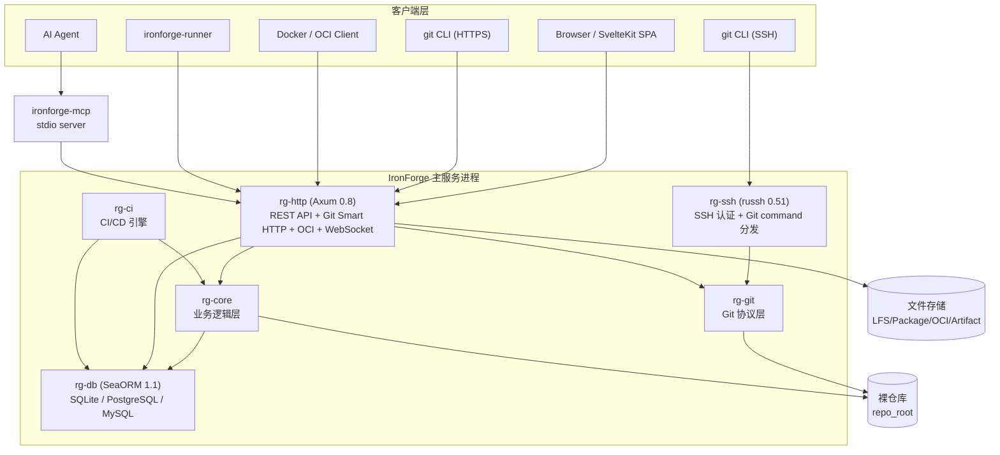
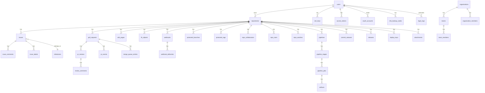
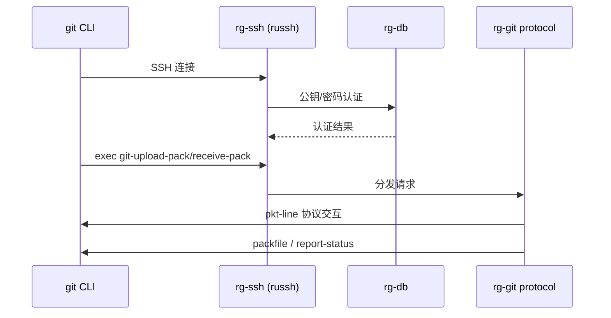
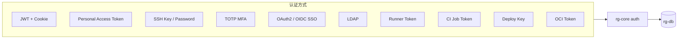
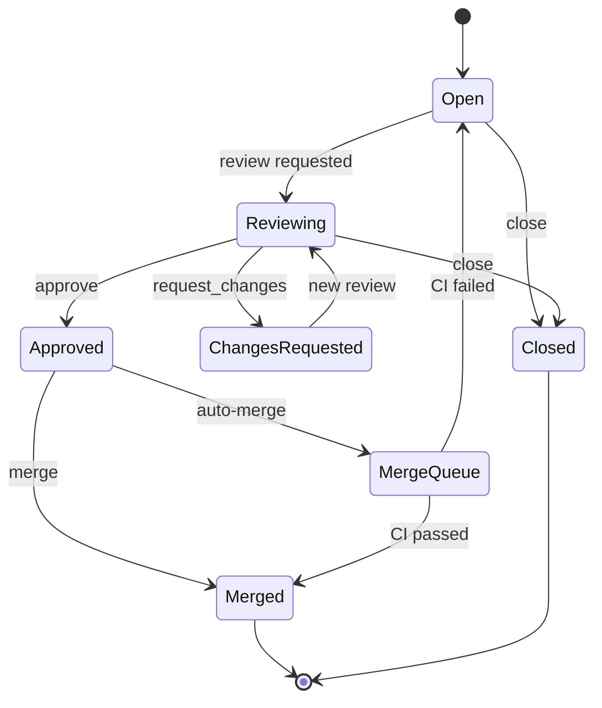
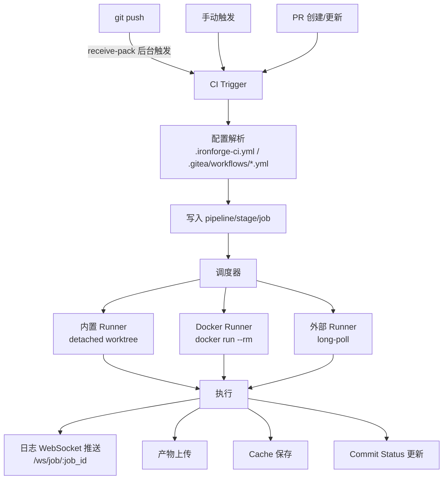

# IronForge 架构设计文档

> **IronForge**（铁匠铺）— 用 Rust 从零造一个 Git 托管平台
> 对标 Gitea / Forgejo，用 Rust 实现极致轻量与高性能

---

## 一、项目愿景

- **极致轻量**：内存占用 < 50MB（对比 Gitea ~200MB）
- **单二进制部署**：一个文件跑起来，Docker 镜像 < 20MB
- **全功能**：仓库管理、用户/组织、Issue、Pull Request、Wiki、CI/CD、包注册表、企业认证、审计、代码搜索
- **跨平台**：macOS + Linux（Docker）

> Phase 1~21 全部完成。当前功能清单见 [CLAUDE.md](CLAUDE.md)。

---

## 二、整体架构



主要边界：

| 层 | 主要路径 | 职责 |
|----|----------|------|
| CLI/进程入口 | `crates/rg-cli/src/main.rs` | 主服务启动、迁移、配置、日志、内置 runner |
| HTTP 服务 | `crates/rg-http/src/` | REST、Git HTTP、OCI、WebSocket、OpenAPI、静态前端 |
| SSH 服务 | `crates/rg-ssh/src/` | SSH 认证、Git command 分发 |
| 业务服务 | `crates/rg-core/src/` | 用户、仓库、Issue、PR、Wiki、CI、Package、审计、SSO/MFA 等 |
| 数据库 | `crates/rg-db/src/` | entities、ops、migrations |
| Git 协议 | `crates/rg-git/src/` | pkt-line、sideband、upload-pack、receive-pack、Protocol V2、Git CLI gateway |
| CI 引擎 | `crates/rg-ci/src/` | CI 配置读取、pipeline 创建、执行器 |
| Runner Agent | `crates/rg-runner/src/` | 外部 runner 注册、轮询、执行、回传日志 |
| MCP Server | `crates/rg-mcp/src/` | MCP tools/resources，调用 IronForge REST API |
| 前端 | `web/src/` | SvelteKit SPA 页面、API client、状态、i18n、组件 |

---

## 三、技术选型

### 3.1 核心框架

| 层级 | 选型 | 版本 | 理由 |
|------|------|------|------|
| 异步运行时 | tokio | 1.x | Rust 异步生态事实标准 |
| HTTP 框架 | axum + axum-server | 0.8 / 0.7 | tokio 官方出品，生态好，性能优秀 |
| SSH 服务端 | russh | 0.51 | 纯 Rust SSH2 实现，支持服务端 |
| Git 操作 | gix (gitoxide) + GitCommandGateway | 0.84 | 纯 Rust Git 实现（~70% 覆盖率），剩余经统一网关调用 git CLI |
| ORM | SeaORM | 1.1 | 异步原生，迁移工具成熟，API 友好 |
| 数据库 | SQLite（默认）/ PostgreSQL / MySQL | — | 轻量起步，支持多后端切换 |
| 序列化 | serde + serde_json + toml | 1.x | Rust 事实标准 |
| 配置 | clap + TOML | 4.x / 0.8 | CLI args > config file > defaults |
| 日志 | tracing + tracing-subscriber + tracing-appender | 0.1 | 结构化日志 + 按日轮转 |
| 认证 | argon2 + JWT + LDAP + OIDC + TOTP | — | 密码哈希 + JWT + 企业认证 |
| TLS | rustls + axum-server | 0.26 | axum-server 原生 TLS 支持 |
| 前端 | SvelteKit 5 (SPA mode) | 5.x | 编译体积小，开发体验好 |
| 代码覆盖率 | cargo-llvm-cov | — | HTML/LCOV/JSON 输出 |
| OpenAPI | utoipa + utoipa-swagger-ui | 5 / 8 | 编译时注解，Swagger UI 嵌入 |

### 3.2 技术选型决策分析

#### ORM 对比

| 维度 | SeaORM | SQLx | Diesel |
|------|--------|------|--------|
| 异步支持 | 原生 | 原生 | 需 async-graphql |
| 动态查询 | 强 | 强 | 编译时强类型 |
| 迁移工具 | 内置 | 需 sqlx-cli | 内置 |
| 适合场景 | 业务逻辑复杂 | 简单查询 | 类型安全优先 |

**选择 SeaORM**：业务层有 User/Repo/Issue/PR/Wiki 等复杂关联，动态查询需求多，SeaORM 的 Builder 模式更灵活。

#### Git 库对比

| 维度 | gix (gitoxide) | git2 (libgit2) |
|------|----------------|----------------|
| 纯 Rust | 是（~70% 覆盖率） | 否，C 依赖 |
| 编译速度 | 快 | 慢（需链接 C） |
| 服务端协议 | 需自行实现 | 不支持 |
| 对象操作 | 成熟 | 非常成熟 |
| 活跃度 | 极高 | 中等 |

**选择 gix**：纯 Rust 的优势在交叉编译和 Docker 镜像体积上回报巨大。服务端协议层（Smart Protocol）是本项目自行实现的核心部分。当前采用 gix + GitCommandGateway 混合模式，逐步将 CLI 调用迁移至 gix 原生 API。

#### 前端框架对比

| 维度 | SvelteKit | Vue + Vite | React + Next.js |
|------|-----------|------------|-----------------|
| 编译体积 | 极小 (~10KB) | 小 (~30KB) | 大 (~40KB+) |
| SSR 支持 | SPA 模式 | 有 | 有 |
| 适合场景 | 轻量 SPA | 通用 | 大型应用 |

**选择 SvelteKit**：SPA 模式（adapter-static），编译产物最小，适合内嵌到二进制中或作为独立前端部署。

---

## 四、Cargo Workspace 结构

```
ironforge/
├── Cargo.toml                    # workspace 根（统一依赖版本）
├── crates/
│   ├── rg-cli/                   # 主二进制入口（bin = "ironforge"）
│   │   └── src/main.rs           #   serve / create-repo / migrate / runner 命令
│   │
│   ├── rg-core/                  # 核心业务逻辑
│   │   └── src/
│   │       ├── auth/             #   认证（argon2/JWT/LDAP/SSO/MFA/TOTP）
│   │       ├── user/             #   用户管理
│   │       ├── repo/             #   仓库管理 + 权限
│   │       ├── issue/             #   Issue + 标签 + 里程碑 + 评论
│   │       ├── pull_request/     #   PR + diff + merge + merge_queue
│   │       ├── review/           #   代码审查 + inline comments
│   │       ├── branch_protection/#   分支保护 + 签名强制
│   │       ├── collaborator/     #   协作者权限
│   │       ├── wiki/             #   Wiki 页面 + 版本历史
│   │       ├── lfs/              #   Git LFS
│   │       ├── webhook/          #   Webhook 注册/触发/投递
│   │       ├── ci/               #   CI 触发器
│   │       ├── notification/    #   通知系统
│   │       ├── email/            #   邮件通知
│   │       ├── org/              #   组织/团队
│   │       ├── package_registry/ #  包注册表（10 种适配器 + OCI）
│   │       ├── audit/            #   审计日志 + 归档
│   │       ├── mirror/           #   仓库镜像
│   │       ├── board/            #   看板
│   │       ├── time_tracking/    #   工时追踪
│   │       ├── import/           #   GitHub/GitLab 导入
│   │       ├── search/           #   FTS5 全文搜索 + 代码索引
│   │       ├── label/            #   标签
│   │       ├── release/          #   Release + Asset
│   │       ├── platform/         #   平台管理（维护模式等）
│   │       ├── blob_storage.rs   #   统一 Blob 存储
│   │       ├── attachment.rs     #   附件管理
│   │       └── issue_template.rs #   Issue/PR 模板
│   │
│   ├── rg-git/                   # Git 协议层（纯协议，无业务逻辑）
│   │   └── src/
│   │       ├── pkt_line.rs       #   pkt-line 编解码
│   │       ├── sideband.rs       #   sideband-64k 多路复用
│   │       ├── cli_gateway.rs    #   Git CLI 统一入口（GitCommandGateway）
│   │       └── protocol/
│   │           ├── upload_pack.rs #  Git upload-pack（clone/fetch）
│   │           ├── receive_pack.rs # Git receive-pack（push）
│   │           └── v2.rs         #   Protocol V2（ls-refs/fetch/object-info）
│   │
│   ├── rg-ssh/                   # SSH 服务端
│   │   └── src/lib.rs            #   russh 0.51，公钥/密码认证 + Deploy Key
│   │
│   ├── rg-http/                  # HTTP 服务端 + REST API
│   │   └── src/
│   │       ├── lib.rs            #   Axum router + AppState + 中间件链
│   │       ├── api/              #   40+ REST API 模块（扁平结构）
│   │       ├── git_v2.rs         #   Git Protocol V2 handler
│   │       ├── oci.rs            #   OCI Distribution Registry（/v2/）
│   │       ├── ws.rs             #   WebSocket（通知 + Job 日志）
│   │       ├── openapi.rs        #   OpenAPI 注解
│   │       ├── pagination.rs     #   统一分页
│   │       ├── rate_limit.rs     #   Token Bucket 限流
│   │       ├── security.rs      #   CORS / CSP / 安全 headers
│   │       ├── middleware.rs     #   Request-ID / 维护模式 / PAT→Bearer
│   │       ├── metrics.rs        #   Prometheus metrics
│   │       ├── instance.rs      #   实例信息 / 维护模式
│   │       └── error.rs          #   统一错误处理
│   │
│   ├── rg-db/                    # 数据库层
│   │   └── src/
│   │       ├── entities/         #   65+ SeaORM 实体
│   │       ├── ops/              #   CRUD 操作函数
│   │       └── migrations/       #   70+ 数据库迁移（自动执行）
│   │
│   ├── rg-ci/                    # CI/CD 引擎
│   │   └── src/
│   │       ├── config.rs         #   .ironforge-ci.yml / Gitea Actions 解析
│   │       ├── runner.rs         #   Pipeline 执行器 + Docker Runner
│   │       ├── condition.rs      #   if 条件安全解释器
│   │       └── gitea_actions.rs  #   Gitea Actions 兼容 adapter
│   │
│   ├── rg-runner/               # Runner Agent（独立二进制）
│   │   └── src/main.rs           #   注册 / 心跳 / 轮询 Job / 执行 / 回传
│   │
│   └── rg-mcp/                  # MCP Server（独立二进制）
│       └── src/
│           ├── main.rs           #   stdio MCP server 入口
│           ├── protocol.rs       #   JSON-RPC 2.0 协议
│           ├── client.rs        #   IronForge REST API 客户端
│           ├── tools/            #   list_repos / read_file / read_dir / get_issue / get_pr
│           └── resources/        #   repo:// / file:// / issue://
│
├── web/                          # SvelteKit 5 前端（独立 SPA）
│   └── src/
│       ├── routes/              #   页面路由
│       ├── lib/
│       │   ├── api/             #   REST API TypeScript 客户端
│       │   ├── stores/          #   状态管理（Svelte 5 runes）
│       │   ├── components/      #   UI 组件
│       │   └── i18n/            #   国际化（中/英，199 key）
│       └── app.html
│
├── docs/                        # 设计文档
├── ironforge-docs/              # 分析报告
├── .ai/                         # AI Agent 接入规范
├── deploy/                      # 部署配置
└── scripts/                     # 自动化测试脚本
```

### Workspace 依赖方向

```text
rg-cli  → rg-ci, rg-core, rg-db, rg-git, rg-http, rg-ssh
rg-http → rg-core, rg-db, rg-git
rg-ssh  → rg-core, rg-db, rg-git
rg-core → rg-db, rg-git
rg-ci   → rg-core, rg-db
rg-db   → (no local deps)
rg-git  → (no local deps)
rg-runner → (no local deps, 通过 HTTP API 通信)
rg-mcp  → (no local deps, 通过 HTTP API 通信)
```

> `rg-runner` 和 `rg-mcp` 是独立客户端型二进制，通过 HTTP API 与主服务通信，不直接依赖任何本地 crate。

### 各 crate 边界规则

详见 [CONTRIBUTING.md](CONTRIBUTING.md) 的「项目结构与 crate 职责」章节。核心原则：

- `rg-git`：纯协议，无业务逻辑，不依赖 rg-core/rg-db
- `rg-ssh`/`rg-http`：传输层，业务逻辑委托给 rg-core
- `rg-core`：业务逻辑，不包含 HTTP/SSH 协议细节
- `rg-db`：纯数据层，不包含业务逻辑

---

## 五、数据模型

数据库实体按领域分为以下几组（共 65+ 张表）：



| 领域 | 代表实体 |
|------|----------|
| 身份与认证 | `users`、`ssh_keys`、`access_tokens`、`password_reset_tokens`、`oauth_accounts`、`mfa_backup_codes`、`login_logs`、`sso_providers` |
| 仓库 | `repositories`、`repo_collaborators`、`repo_stars`、`repo_watches`、`protected_branches`、`protected_tags`、`deploy_keys`、`commit_statuses` |
| Issue / PR / Review | `issues`、`issue_comments`、`labels`、`issue_labels`、`milestones`、`pull_requests`、`pr_reviews`、`review_comments`、`pr_events`、`merge_queue_entries` |
| Wiki / Release / LFS | `wiki_pages`、`wiki_revisions`、`releases`、`release_assets`、`lfs_objects`、`attachments` |
| CI/CD | `pipelines`、`pipeline_stages`、`pipeline_jobs`、`runners`、`artifacts`、`ci_secrets`、`ci_environments`、`ci_environment_approvals`、`ci_retention_policies`、`ci_cache_entries` |
| 组织与通知 | `organizations`、`teams`、`team_members`、`organization_members`、`notifications` |
| Package / OCI | `package_registries`、`packages`、`package_versions`、`package_files`、`oci_repositories`、`oci_blobs`、`oci_manifests`、`oci_uploads` |
| 扩展能力 | `webhooks`、`webhook_deliveries`、`mirrors`、`boards`、`board_columns`、`board_cards`、`time_entries`、`import_tasks`、`audit_logs` |
| 搜索 | `repos_fts`、`issues_fts`、`wiki_pages_fts`、`code_fts`（FTS5 虚拟表） |

迁移要点：
- 迁移位于 `crates/rg-db/src/migrations/`，`serve` 和 `migrate` 都调用 `rg_db::run_migrations`。
- 支持多后端：SQLite、PostgreSQL、MySQL，backend-aware 迁移和 FTS 实现。
- 非幂等语句用 `manager.has_table()/has_column()` 守卫。
- 新增表时务必显式指定表名，确保与实体 `table_name` 一致（单复数踩坑教训）。

---

## 六、核心子系统设计

### 6.1 Git 协议层

这是整个项目**技术难度最高**的模块。从零实现了 Git Smart Protocol V1 + V2。

#### SSH 通道（russh）



#### HTTP 通道（Axum）

```text
GET  /git/{owner}/{repo}/info/refs?service=git-upload-pack   → advertisement
POST /git/{owner}/{repo}/git-upload-pack                      → fetch/clone
POST /git/{owner}/{repo}/git-receive-pack                    → push
GET  /git/{owner}/{repo}/HEAD                                 → HEAD ref
```

HTTP Git 和 SSH Git 共同复用 `rg-git` 协议层。HTTP Git 已接入 JWT/PAT 鉴权 + `can_read/can_write` 权限校验。SSH Git 在 exec path 接入 repo-level 权限检查。

#### Protocol V2

`rg-git/src/protocol/v2.rs` 实现了：
- `ls-refs` 命令
- `fetch` 命令（shallow / deepen / partial-clone filter）
- `object-info` 命令
- HTTP 通过 `Git-Protocol: version=2` header 检测切换

#### GitCommandGateway

所有 git 子进程调用统一走 `rg-git/src/cli_gateway.rs`，防回归守卫 `test_no_raw_git_command_in_crates` 确保不新增 `Command::new("git")`。当前 gix 原生覆盖率 ~70%，16 处 CLI 经网关保留（Diff/Fetch/Rebase/Pack/GPG/Clone），等待 gix 上游能力成熟后逐步迁移。

### 6.2 认证与安全



认证安全特性：
- 密码哈希：argon2
- JWT：HS256，HttpOnly Cookie（`ironforge_token`）
- MFA：TOTP + QR 码，五分钟 challenge cookie，五次失败锁定 15 分钟
- SSO：OIDC discovery + PKCE S256
- LDAP：RFC 4515 转义、搜索结果唯一性、10 秒超时、TLS 默认校验
- Rate Limiting：Token Bucket per-IP
- 安全中间件：CSP nonce、安全 headers、CORS、Request-ID

### 6.3 Pull Request 引擎

PR 的核心是 diff 计算 + 状态机 + 分支保护 + Webhook：



合并策略：
- **Merge Commit**（默认）：保留完整提交历史
- **Squash and Merge**：压缩为单个提交
- **Rebase and Merge**：变基后逐个提交

分支保护规则：
- Require PR before merge
- Require approval（指定审批人数）
- Required status checks（CI 必须通过）
- Require signed commits（GPG 签名验证）
- Tag 保护（通配 pattern + 允许用户白名单）

Merge Queue：FIFO 队首生成 speculative merge commit，CI 成功后才合并。

### 6.4 CI/CD 引擎



CI 能力矩阵：
- 原生 `.ironforge-ci.yml` + Gitea/GitHub Actions 兼容转换
- Stage/Job 串行执行 + matrix 展开（256 上限）
- CI Secrets（AES-256-GCM 加密）+ 日志脱敏
- 受保护 Environment + 审批门控
- CI Cache（`actions/cache@v4` 兼容）
- Reusable Workflow（本地 `workflow_call`）
- `if` 条件安全解释器（不调用 shell eval）
- `allow_failure` / `timeout` / `when: manual`
- OIDC workload identity（Ed25519 JWKS，5 分钟 token）
- 保留策略（Artifact 30 天 / Cache 7 天默认）
- Tag 保护 + 签名提交强制

### 6.5 Wiki 引擎

Wiki 使用数据库存储（非 Git 仓库后端），支持：
- 页面 CRUD + Markdown 渲染
- 版本历史（`wiki_revisions` 表）
- 页面版本对比（diff）
- 按 Wiki 页面隔离权限

### 6.6 Package Registry

通用 DB 模型 + 文件存储 + adapter 模式：

| 类型 | 协议 |
|------|------|
| Cargo | sparse index |
| npm | registry metadata |
| PyPI | PEP 503 Simple Index |
| Maven | maven-metadata.xml |
| NuGet | service/registration/search |
| Helm | index.yaml |
| RubyGems | dependencies API |
| Composer | packagist metadata |
| Docker / OCI | OCI Distribution Spec v1.0（`/v2/` 路由） |
| Generic | 通用文件存储（fallback） |

文件存储接入统一 `BlobStorage`，支持内容寻址和原子写入。

### 6.7 通知与实时通信

- **WebSocket 通知**：按用户隔离的通知 channel + Job 日志按 `job_id` 隔离 channel
- **邮件通知**：SMTP（lettre）+ HTML 模板
- **审计日志**：`audit!` 宏 fire-and-forget + 90 天 NDJSON.zst 归档

---

## 七、运行入口

### 7.1 二进制入口

| 二进制 | crate | 用途 |
|--------|-------|------|
| `ironforge` | `rg-cli` | 主服务与管理 CLI（serve / create-repo / migrate / runner） |
| `ironforge-runner` | `rg-runner` | 独立 CI Runner Agent |
| `ironforge-mcp` | `rg-mcp` | MCP stdio server |

### 7.2 主服务启动链路

```text
ironforge serve
  → load optional TOML config
  → resolve JWT/config/logging/timeouts
  → init tracing ( RollingFileAppender )
  → create repo_root
  → init GitCommandGateway
  → rg_db::connect_with_timeouts
  → rg_db::run_migrations
  → build AppState
  → spawn rg_http::run(...)
  → spawn rg_ssh::start_ssh_server(...)
  → await HTTP task
```

运行特征：
- HTTP 与 SSH 在同一主服务进程中启动
- SSH 启动失败不会阻止 HTTP 继续运行
- 数据库迁移在 `serve` 启动时自动执行
- `host_key` 缺失时自动生成 ed25519 key（零配置可用）

### 7.3 HTTP 路由前缀

| 前缀 | 用途 |
|------|------|
| `/api/v1` | REST API（40+ 模块） |
| `/git/{owner}/{repo}/...` | Git Smart HTTP |
| `/{owner}/{repo}/info/refs` 等 | 兼容 Git Smart HTTP |
| `/v2` | OCI Distribution Registry |
| `/api/v1/ws/notifications` | 通知 WebSocket（按用户隔离） |
| `/api/v1/ws/job/{job_id}` | CI 日志 WebSocket（按 Job 隔离） |
| `/health` | 健康检查（DB + FS + metrics + git gateway + smtp） |
| `/metrics` | Prometheus metrics |
| `/api-docs` | Swagger UI / OpenAPI |
| SPA fallback | `web/build/index.html` |

### 7.4 中间件链

生产 router 中间件顺序：
1. Metrics middleware
2. Security headers + CSP nonce
3. Request-ID
4. TraceLayer
5. CORS
6. ConnectInfo
7. Rate limit
8. Maintenance mode
9. PAT-to-Bearer middleware
10. Docs auth middleware

---

## 八、构建与部署

### 8.1 构建产物

```text
web npm run build → web/build/

cargo build --release
  → target/release/ironforge
  → target/release/ironforge-runner
  → target/release/ironforge-mcp
```

### 8.2 Docker 构建

```text
node frontend build
  → rust release build --bin ironforge --bin ironforge-runner --bin ironforge-mcp
  → debian runtime
  → copy /app/web/build
  → copy /usr/local/bin/ironforge
  → copy /usr/local/bin/ironforge-runner
  → copy /usr/local/bin/ironforge-mcp
```

### 8.3 运行数据

```text
/data/repos          # bare repositories
/data/ironforge.db   # SQLite 数据库
/data/logs/          # 日志文件
```

### 8.4 健康检查与观测

`/health` 检查：database / filesystem / metrics / git gateway / smtp。

`/metrics` 输出 Prometheus text format。`deploy/` 中提供 Prometheus、Alertmanager、Grafana 和 node-exporter 示例配置。

---

## 九、测试体系

| 层级 | 工具 | 范围 |
|------|------|------|
| 后端单元测试 | `cargo test -p <crate>` | 各 crate 独立测试 |
| 后端集成测试 | `cargo test -p rg-http` | API 集成测试 |
| 代码覆盖率 | `cargo-llvm-cov` | HTML / LCOV / JSON |
| 前端类型检查 | `npm run check` | TypeScript / Svelte 类型 |
| 前端构建验证 | `npm run build` | 生产构建 |
| 全量回归 | `scripts/full-interface-regression.mjs` | 后端 + 前端 + 运行态 smoke |
| OpenAPI 冒烟 | `scripts/openapi-interface-smoke.mjs` | 全部 OpenAPI 接口可用性 |
| 前端运行态 | `scripts/console-smoke.mjs` | console/network 错误检测 |
| API 参数对齐 | `scripts/api-client-contract-check.mjs` | 前端 client vs OpenAPI |
| 前后端联调 | `scripts/frontend-backend-smoke.mjs` | 关键通道打通验证 |

变更区域与测试命令映射见 [CONTRIBUTING.md](CONTRIBUTING.md)。

---

## 十、风险与缓解

| 风险 | 影响 | 缓解策略 |
|------|------|----------|
| gix 服务端 API 不成熟 | 部分操作仍需 git CLI | GitCommandGateway 统一入口，逐步迁移 |
| SQLite 并发写入瓶颈 | 大规模部署受限 | 支持 PostgreSQL/MySQL 多后端 |
| CI/CD 安全性 | 执行用户脚本的风险 | Docker 容器隔离 + Secret 最小注入 + 网络断开 |
| 前端 SPA 无 SSR | SEO 不友好 | 定位为开发者工具，非面向公众 |
| 迁移表名单复数不一致 | 运行时 no such table | 显式指定表名 + 全新库验证 + 集成测试守护 |

---

## 十一、技术债与后续方向

| 待办 | 阻塞原因 | 解除条件 |
|------|----------|----------|
| Rebase 合并 gix 原生化 | gix-rebase 无 API | gix 发布稳定 rebase API |
| Pack 生成 gix 原生化 | gix 无高层 pack 协商 | gix 提供 server 端 pack 生成 |
| Thin-pack 索引 gix 原生化 | gix 缺 thin 补全解析 | gix-pack 支持 --fix-thin |
| GPG 验签 gix 原生化 | gix 无验签能力 | gix 内建或引入 sequoia-openpgp |
| blob-diff unified patch | 字节一致性待验证 | 对拍测试通过 |
| MCP SSE transport | 未实现 | 按需排期 |
| PostgreSQL/MySQL HA | 兼容验证已完成 | 生产化压测 / 备份恢复 / HA 集群 |

> 详见 [ironforge-docs/architecture/architecture-followups-2026-07.md](ironforge-docs/architecture/architecture-followups-2026-07.md)。

---

## 十二、文档导航

| 文件 | 用途 |
|------|------|
| [CLAUDE.md](CLAUDE.md) | AI 深度协作上下文（踩坑记录、依赖版本、错误排查、实现清单） |
| [README.md](README.md) | 快速开始、REST API 示例 |
| [CONTRIBUTING.md](CONTRIBUTING.md) | 开发规范、crate 边界、编码规范、测试规范 |
| [ironforge-docs/architecture/project-architecture-2026-07.md](ironforge-docs/architecture/project-architecture-2026-07.md) | 当前代码事实架构总览（2026-07 基线） |
| [ironforge-docs/architecture/frontend-backend-structure-2026-07.md](ironforge-docs/architecture/frontend-backend-structure-2026-07.md) | 前后端结构与页面/API 映射 |
| [ironforge-docs/architecture/architecture-followups-2026-07.md](ironforge-docs/architecture/architecture-followups-2026-07.md) | 已修复项、P2 长期方向 |
| [ironforge-docs/README.md](ironforge-docs/README.md) | 分析报告文档索引 |

---

*Phase 1~21 全部完成。本文档反映当前代码实际结构，如有不一致以代码为准。*
