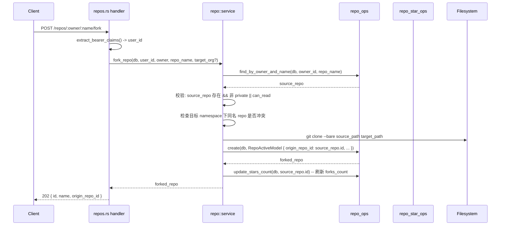
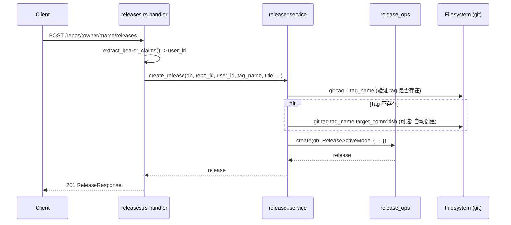
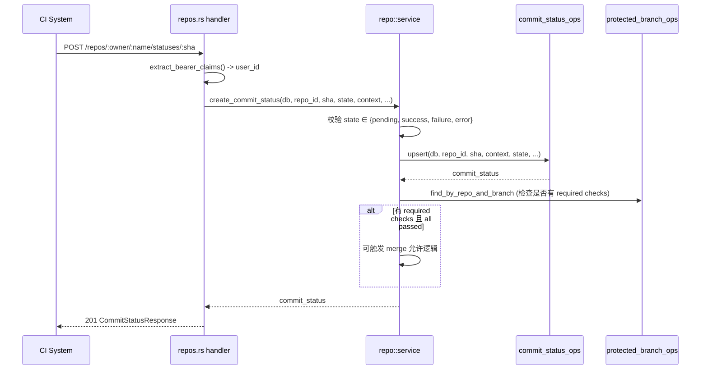
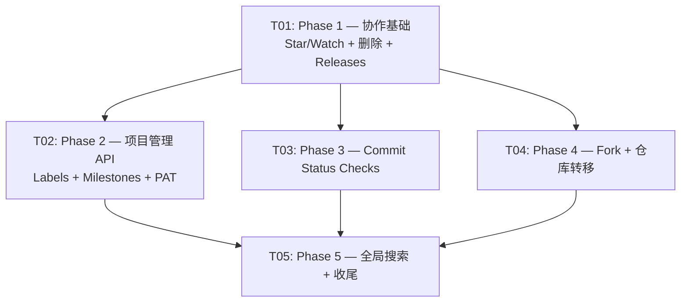

# IronForge P0 功能 — 系统设计 + 任务分解

> 版本：v1.0 | 日期：2026-05-08 | 架构师：高见远（Gao）

---

## Part A: 系统设计

### 1. 实现方案

#### 核心技术挑战

| 挑战 | 说明 | 方案 |
|------|------|------|
| Fork 仓库 | 需要复制 Git 数据 + 元数据 + fork_id 双向关联 | `git clone --bare` 复制磁盘数据；DB 中创建新 repo 记录，设置 `fork_id` + `origin_repo_id`；原子性由事务保证 |
| Star/Watch 并发安全 | stars_count 需要原子增减 | 使用 `repo_stars` 独立表 + `SELECT COUNT` 替代直接 UPDATE 计数字段，避免竞态；stars_count 作为缓存字段由写操作刷新 |
| Releases + Tags | Tag 来自 Git 对象，Release 是 DB 记录 | `git tag -l` 获取已有 Tags；Release 与 tag_name 关联；Release Assets 上传到 `repo_root/{owner}/{repo}.git/releases/{tag}/{filename}` |
| Labels 独立表迁移 | 从 `issues.labels` JSON 列迁移到关联表 | 新建 `labels` 表 + `issue_labels` 关联表；迁移中保留旧 `labels` 列做兼容；Phase 2 完成后可废弃 JSON 列 |
| 仓库删除 | 需要软删除 + 关联数据清理 | `repositories` 表加 `deleted_at` 字段；查询时加 `WHERE deleted_at IS NULL` 过滤；Git 磁盘数据异步清理 |
| 仓库转移 | 所有权变更 + 磁盘路径移动 | 更新 `owner_id` / `org_id`；移动 Git 磁盘目录 `old_owner/repo.git → new_owner/repo.git`；需处理目标路径冲突 |
| Commit Status Checks | 与 Branch Protection 联动 | 新建 `commit_statuses` 表；Branch Protection 的 `required_status_checks` JSON 字段已有，仅需在 PR merge 时校验 |
| FTS5 全局搜索 | SQLite FTS5 索引 + 增量更新 | 创建 FTS5 虚拟表 `repos_fts` / `issues_fts` / `wiki_pages_fts`；写操作后触发 `INSERT INTO ..._fts` 同步更新 |

#### 框架与库选择

- **不引入新 crate**。所有功能基于已有 `sea-orm` / `axum` / `serde` / `chrono` 实现
- FTS5 是 SQLite 内置扩展，通过 `sea-orm-migration` 的 raw SQL 执行 `CREATE VIRTUAL TABLE` 即可
- Token 生成使用已有 `uuid` crate（`rg-db` 已依赖）

#### 架构模式

严格遵循已有三层架构：

```
HTTP Handler (rg-http/src/api/*.rs)
  ↓ extract_bearer_claims() 鉴权
Service Layer (rg-core/src/*/service.rs)
  ↓ 业务逻辑 + 权限校验
Ops Layer (rg-db/src/ops/*_ops.rs)
  ↓ 数据库 CRUD
Entity (rg-db/src/entities/*.rs)
  ↓ SeaORM Entity 映射
```

---

### 2. 完整文件列表

#### 新建文件

| # | 文件路径 | 说明 |
|---|---------|------|
| 1 | `crates/rg-db/src/entities/repo_star.rs` | repo_stars 实体 |
| 2 | `crates/rg-db/src/entities/repo_watch.rs` | repo_watches 实体 |
| 3 | `crates/rg-db/src/entities/release.rs` | releases 实体 |
| 4 | `crates/rg-db/src/entities/release_asset.rs` | release_assets 实体 |
| 5 | `crates/rg-db/src/entities/label.rs` | labels 实体 |
| 6 | `crates/rg-db/src/entities/issue_label.rs` | issue_labels 关联实体 |
| 7 | `crates/rg-db/src/entities/commit_status.rs` | commit_statuses 实体 |
| 8 | `crates/rg-db/src/ops/repo_star_ops.rs` | Star CRUD ops |
| 9 | `crates/rg-db/src/ops/repo_watch_ops.rs` | Watch CRUD ops |
| 10 | `crates/rg-db/src/ops/release_ops.rs` | Release + ReleaseAsset CRUD ops |
| 11 | `crates/rg-db/src/ops/label_ops.rs` | Label CRUD ops |
| 12 | `crates/rg-db/src/ops/issue_label_ops.rs` | Issue-Label 关联 ops |
| 13 | `crates/rg-db/src/ops/commit_status_ops.rs` | CommitStatus CRUD ops |
| 14 | `crates/rg-db/src/migrations/m20260508_000001_create_repo_stars_watches.rs` | Phase 1: star/watch 表 |
| 15 | `crates/rg-db/src/migrations/m20260508_000002_create_releases.rs` | Phase 1: releases + release_assets 表 |
| 16 | `crates/rg-db/src/migrations/m20260508_000001_add_repo_soft_delete.rs` | Phase 1: repositories 加 deleted_at + origin_repo_id |
| 17 | `crates/rg-db/src/migrations/m20260508_000003_create_labels.rs` | Phase 2: labels + issue_labels 表 |
| 18 | `crates/rg-db/src/migrations/m20260508_000004_create_commit_statuses.rs` | Phase 3: commit_statuses 表 |
| 19 | `crates/rg-db/src/migrations/m20260508_000005_create_fts5_indexes.rs` | Phase 5: FTS5 虚拟表 |
| 20 | `crates/rg-http/src/api/releases.rs` | Releases API handlers |
| 21 | `crates/rg-http/src/api/labels.rs` | Labels API handlers |
| 22 | `crates/rg-http/src/api/search.rs` | 全局搜索 API handler |
| 23 | `crates/rg-core/src/release/mod.rs` | Release service 模块 |
| 24 | `crates/rg-core/src/release/service.rs` | Release 业务逻辑 |
| 25 | `crates/rg-core/src/label/mod.rs` | Label service 模块 |
| 26 | `crates/rg-core/src/label/service.rs` | Label 业务逻辑 |
| 27 | `crates/rg-core/src/search/mod.rs` | Search service 模块 |
| 28 | `crates/rg-core/src/search/service.rs` | Search 业务逻辑 |

#### 修改文件

| # | 文件路径 | 修改内容 |
|---|---------|---------|
| 29 | `crates/rg-db/src/entities/mod.rs` | 新增 7 个 `pub mod` 声明 |
| 30 | `crates/rg-db/src/entities/repository.rs` | 新增 `deleted_at` + `origin_repo_id` 字段 |
| 31 | `crates/rg-db/src/ops/mod.rs` | 新增 6 个 `pub mod` 声明 |
| 32 | `crates/rg-db/src/ops/repo_ops.rs` | 新增 soft_delete / transfer / find_forks / update_stars_count 等函数 |
| 33 | `crates/rg-db/src/migrations/mod.rs` | 注册新迁移 |
| 34 | `crates/rg-core/src/lib.rs` | 新增 `pub mod release; pub mod label; pub mod search;` |
| 35 | `crates/rg-core/src/repo/service.rs` | 新增 fork_repo / delete_repo / transfer_repo / star_repo / unstar_repo / watch_repo 函数 |
| 36 | `crates/rg-core/src/issue/service.rs` | 修改 labels 处理逻辑，支持 issue_labels 关联表 |
| 37 | `crates/rg-http/src/api/mod.rs` | 新增 `pub mod releases; pub mod labels; pub mod search;` |
| 38 | `crates/rg-http/src/api/repos.rs` | 新增 delete_repo / fork_repo / transfer_repo / star / unstar / watch handlers |
| 39 | `crates/rg-http/src/api/issues.rs` | 新增 milestones / labels API handlers |
| 40 | `crates/rg-http/src/api/users.rs` | 新增 PAT (access_tokens) CRUD handlers |
| 41 | `crates/rg-http/src/lib.rs` | 在 `create_router()` 中注册新路由 |
| 42 | `web/src/lib/api/client.ts` | 新增 repos.star / repos.watch / repos.fork / repos.delete / repos.transfer / releases / labels / search / tokens namespace |

---

### 3. 数据结构

#### 3.1 新建表 Schema

##### `repo_stars` 表

| 字段 | 类型 | 约束 | 说明 |
|------|------|------|------|
| id | BIGINT | PK, AUTO_INCREMENT | |
| user_id | BIGINT | NOT NULL, FK → users.id | Star 的用户 |
| repo_id | BIGINT | NOT NULL, FK → repositories.id | 被 Star 的仓库 |
| created_at | TIMESTAMP WITH TIMEZONE | NOT NULL, DEFAULT now() | |

索引：`UNIQUE(user_id, repo_id)`, `INDEX(repo_id)`

##### `repo_watches` 表

| 字段 | 类型 | 约束 | 说明 |
|------|------|------|------|
| id | BIGINT | PK, AUTO_INCREMENT | |
| user_id | BIGINT | NOT NULL, FK → users.id | |
| repo_id | BIGINT | NOT NULL, FK → repositories.id | |
| watch_state | VARCHAR(20) | NOT NULL, DEFAULT 'not_watching' | `not_watching` / `watching` / `ignoring` |
| created_at | TIMESTAMP WITH TIMEZONE | NOT NULL, DEFAULT now() | |
| updated_at | TIMESTAMP WITH TIMEZONE | NOT NULL, DEFAULT now() | |

索引：`UNIQUE(user_id, repo_id)`, `INDEX(repo_id)`

##### `releases` 表

| 字段 | 类型 | 约束 | 说明 |
|------|------|------|------|
| id | BIGINT | PK, AUTO_INCREMENT | |
| repo_id | BIGINT | NOT NULL, FK → repositories.id | |
| tag_name | VARCHAR(255) | NOT NULL | 关联的 Git Tag |
| target_commitish | VARCHAR(255) | DEFAULT 'main' | Tag 指向的分支/SHA |
| title | VARCHAR(255) | NOT NULL | Release 标题 |
| body | TEXT | NULL | Release 描述 (Markdown) |
| is_draft | BOOLEAN | NOT NULL, DEFAULT false | |
| is_prerelease | BOOLEAN | NOT NULL, DEFAULT false | |
| author_id | BIGINT | NOT NULL, FK → users.id | |
| created_at | TIMESTAMP WITH TIMEZONE | NOT NULL, DEFAULT now() | |
| updated_at | TIMESTAMP WITH TIMEZONE | NOT NULL, DEFAULT now() | |

索引：`UNIQUE(repo_id, tag_name)`, `INDEX(repo_id)`

##### `release_assets` 表

| 字段 | 类型 | 约束 | 说明 |
|------|------|------|------|
| id | BIGINT | PK, AUTO_INCREMENT | |
| release_id | BIGINT | NOT NULL, FK → releases.id | |
| name | VARCHAR(255) | NOT NULL | 文件名 |
| size | BIGINT | NOT NULL, DEFAULT 0 | 字节数 |
| download_count | BIGINT | NOT NULL, DEFAULT 0 | |
| uploader_id | BIGINT | NOT NULL, FK → users.id | |
| created_at | TIMESTAMP WITH TIMEZONE | NOT NULL, DEFAULT now() | |

索引：`INDEX(release_id)`

##### `labels` 表

| 字段 | 类型 | 约束 | 说明 |
|------|------|------|------|
| id | BIGINT | PK, AUTO_INCREMENT | |
| repo_id | BIGINT | NOT NULL, FK → repositories.id | |
| name | VARCHAR(100) | NOT NULL | 标签名 |
| color | VARCHAR(7) | NOT NULL | Hex 颜色如 `#ff0000` |
| description | VARCHAR(500) | NULL | |
| created_at | TIMESTAMP WITH TIMEZONE | NOT NULL, DEFAULT now() | |
| updated_at | TIMESTAMP WITH TIMEZONE | NOT NULL, DEFAULT now() | |

索引：`UNIQUE(repo_id, name)`, `INDEX(repo_id)`

##### `issue_labels` 表

| 字段 | 类型 | 约束 | 说明 |
|------|------|------|------|
| id | BIGINT | PK, AUTO_INCREMENT | |
| issue_id | BIGINT | NOT NULL, FK → issues.id | |
| label_id | BIGINT | NOT NULL, FK → labels.id | |
| created_at | TIMESTAMP WITH TIMEZONE | NOT NULL, DEFAULT now() | |

索引：`UNIQUE(issue_id, label_id)`, `INDEX(label_id)`

##### `commit_statuses` 表

| 字段 | 类型 | 约束 | 说明 |
|------|------|------|------|
| id | BIGINT | PK, AUTO_INCREMENT | |
| repo_id | BIGINT | NOT NULL, FK → repositories.id | |
| sha | VARCHAR(40) | NOT NULL | Commit SHA |
| state | VARCHAR(20) | NOT NULL | `pending` / `success` / `failure` / `error` |
| context | VARCHAR(255) | NOT NULL | 如 `ci/test-suite` |
| description | VARCHAR(500) | NULL | |
| target_url | VARCHAR(500) | NULL | 详情链接 |
| creator_id | BIGINT | NOT NULL, FK → users.id | |
| created_at | TIMESTAMP WITH TIMEZONE | NOT NULL, DEFAULT now() | |
| updated_at | TIMESTAMP WITH TIMEZONE | NOT NULL, DEFAULT now() | |

索引：`UNIQUE(repo_id, sha, context)`, `INDEX(repo_id, sha)`

#### 3.2 修改已有表

##### `repositories` 表新增字段

| 字段 | 类型 | 约束 | 说明 |
|------|------|------|------|
| deleted_at | TIMESTAMP WITH TIMEZONE | NULL | 软删除标记，NULL 表示未删除 |
| origin_repo_id | BIGINT | NULL | Fork 源仓库 ID（区别于已有 fork_id：fork_id 存 fork 出去的子仓库，origin_repo_id 存当前仓库的上游源） |

> 注：已有 `fork_id: Option<i64>` 字段，但在实际使用中语义不清晰。新增 `origin_repo_id` 明确表示"我从哪 fork 来的"，`fork_id` 保留但不再主动使用。

#### 3.3 FTS5 虚拟表

```sql
CREATE VIRTUAL TABLE repos_fts USING fts5(name, description, owner, content=repositories, content_rowid=id);
CREATE VIRTUAL TABLE issues_fts USING fts5(title, body, content=issues, content_rowid=id);
CREATE VIRTUAL TABLE wiki_pages_fts USING fts5(title, content, content=wiki_pages, content_rowid=id);
```

使用 content-sync 模式（`content=` 指向原表），避免数据冗余存储。写操作后需要手动触发 `INSERT INTO ..._fts(fts) VALUES('rebuild')` 或逐行同步。

---

### 4. API 设计

所有 API 遵循已有模式：`/api/v1/...`，鉴权用 `extract_bearer_claims()`，响应用 `(StatusCode, Json(serde_json::json!(...)))`.

#### 4.1 Phase 1: 协作基础

##### Star/Watch

| Method | Path | 说明 | 鉴权 | Request | Response |
|--------|------|------|------|---------|----------|
| PUT | `/repos/:owner/:name/star` | Star 仓库 | Required | - | `200 { "starred": true }` |
| DELETE | `/repos/:owner/:name/star` | 取消 Star | Required | - | `200 { "starred": false }` |
| GET | `/repos/:owner/:name/stargazers` | Star 列表 | Optional | `?page=&per_page=` | `200 PaginatedResponse<{ user_id, username, created_at }>` |
| PUT | `/repos/:owner/:name/watch` | Watch 仓库 | Required | `{ "state": "watching" }` | `200 { "watch_state": "watching" }` |
| DELETE | `/repos/:owner/:name/watch` | 取消 Watch | Required | - | `200 { "watch_state": "not_watching" }` |
| GET | `/repos/:owner/:name/watchers` | Watch 列表 | Optional | `?page=&per_page=` | `200 PaginatedResponse<{ user_id, username, watch_state }>` |

##### 仓库删除

| Method | Path | 说明 | 鉴权 | Request | Response |
|--------|------|------|------|---------|----------|
| DELETE | `/repos/:owner/:name` | 软删除仓库 | Required (owner) | - | `200 { "deleted": true }` |

##### Releases/Tags

| Method | Path | 说明 | 鉴权 | Request | Response |
|--------|------|------|------|---------|----------|
| GET | `/repos/:owner/:name/releases` | Release 列表 | Optional | `?page=&per_page=` | `200 PaginatedResponse<ReleaseResponse>` |
| GET | `/repos/:owner/:name/releases/:id` | 获取单个 Release | Optional | - | `200 ReleaseResponse` |
| POST | `/repos/:owner/:name/releases` | 创建 Release | Required | `{ tag_name, title, body?, target_commitish?, is_draft?, is_prerelease? }` | `201 ReleaseResponse` |
| PATCH | `/repos/:owner/:name/releases/:id` | 更新 Release | Required | `{ title?, body?, is_draft?, is_prerelease? }` | `200 ReleaseResponse` |
| DELETE | `/repos/:owner/:name/releases/:id` | 删除 Release | Required | - | `204` |
| GET | `/repos/:owner/:name/releases/:id/assets` | Asset 列表 | Optional | - | `200 [ReleaseAssetResponse]` |
| POST | `/repos/:owner/:name/releases/:id/assets` | 上传 Asset | Required (multipart) | `multipart/form-data: file` | `201 ReleaseAssetResponse` |
| DELETE | `/repos/:owner/:name/releases/assets/:id` | 删除 Asset | Required | - | `204` |

**ReleaseResponse:**
```json
{
  "id": 1,
  "tag_name": "v1.0.0",
  "target_commitish": "main",
  "title": "First Release",
  "body": "Description...",
  "is_draft": false,
  "is_prerelease": false,
  "author": { "id": 1, "username": "alice" },
  "assets": [],
  "created_at": "...",
  "updated_at": "..."
}
```

#### 4.2 Phase 2: 项目管理 API

##### Labels

| Method | Path | 说明 | 鉴权 | Request | Response |
|--------|------|------|------|---------|----------|
| GET | `/repos/:owner/:name/labels` | Label 列表 | Optional | - | `200 [LabelResponse]` |
| GET | `/repos/:owner/:name/labels/:id` | 获取 Label | Optional | - | `200 LabelResponse` |
| POST | `/repos/:owner/:name/labels` | 创建 Label | Required (write) | `{ name, color, description? }` | `201 LabelResponse` |
| PATCH | `/repos/:owner/:name/labels/:id` | 更新 Label | Required (write) | `{ name?, color?, description? }` | `200 LabelResponse` |
| DELETE | `/repos/:owner/:name/labels/:id` | 删除 Label | Required (write) | - | `204` |

**LabelResponse:**
```json
{
  "id": 1,
  "name": "bug",
  "color": "#ff0000",
  "description": "Something isn't working",
  "created_at": "..."
}
```

##### Milestones API

| Method | Path | 说明 | 鉴权 | Request | Response |
|--------|------|------|------|---------|----------|
| GET | `/repos/:owner/:name/milestones` | Milestone 列表 | Optional | `?state=open` | `200 [MilestoneResponse]` |
| GET | `/repos/:owner/:name/milestones/:id` | 获取 Milestone | Optional | - | `200 MilestoneResponse` |
| POST | `/repos/:owner/:name/milestones` | 创建 Milestone | Required (write) | `{ title, description?, due_date?, state? }` | `201 MilestoneResponse` |
| PATCH | `/repos/:owner/:name/milestones/:id` | 更新 Milestone | Required (write) | `{ title?, description?, state?, due_date? }` | `200 MilestoneResponse` |
| DELETE | `/repos/:owner/:name/milestones/:id` | 删除 Milestone | Required (write) | - | `204` |

##### API Tokens / PAT

| Method | Path | 说明 | 鉴权 | Request | Response |
|--------|------|------|------|---------|----------|
| GET | `/users/tokens` | 列出当前用户 Token | Required | - | `200 [{ id, name, scopes, expires_at, last_used_at, created_at }]` |
| POST | `/users/tokens` | 创建 PAT | Required | `{ name, scopes?, expires_at? }` | `201 { id, name, token: "ifp_xxx...", scopes, expires_at }` |
| DELETE | `/users/tokens/:id` | 吊销 Token | Required | - | `204` |

> 注：创建时返回完整明文 token，仅此一次。DB 中仅存 SHA-256 hash。

#### 4.3 Phase 3: Commit Status Checks

| Method | Path | 说明 | 鉴权 | Request | Response |
|--------|------|------|------|---------|----------|
| POST | `/repos/:owner/:name/statuses/:sha` | 创建/更新 Status | Required (write) | `{ state, context, description?, target_url? }` | `201 CommitStatusResponse` |
| GET | `/repos/:owner/:name/commits/:sha/statuses` | 获取 SHA 所有 Status | Optional | - | `200 [CommitStatusResponse]` |
| GET | `/repos/:owner/:name/commits/:sha/status` | 获取组合状态 | Optional | - | `200 { state, statuses: [...] }` |

**CommitStatusResponse:**
```json
{
  "id": 1,
  "sha": "abc123...",
  "state": "success",
  "context": "ci/test-suite",
  "description": "All tests passed",
  "target_url": "https://...",
  "creator": { "id": 1, "username": "alice" },
  "created_at": "...",
  "updated_at": "..."
}
```

#### 4.4 Phase 4: Fork 与仓库转移

| Method | Path | 说明 | 鉴权 | Request | Response |
|--------|------|------|------|---------|----------|
| POST | `/repos/:owner/:name/fork` | Fork 仓库 | Required | `{ org?: "org-name" }` | `202 { id, name, owner, origin_repo_id }` |
| GET | `/repos/:owner/:name/forks` | Fork 列表 | Optional | `?page=&per_page=` | `200 PaginatedResponse<RepoResponse>` |
| POST | `/repos/:owner/:name/transfer` | 转移仓库 | Required (owner) | `{ new_owner: "username-or-org" }` | `200 { id, name, new_owner }` |

#### 4.5 Phase 5: 全局搜索

| Method | Path | 说明 | 鉴权 | Request | Response |
|--------|------|------|------|---------|----------|
| GET | `/search` | 全局搜索 | Optional | `?q=keyword&type=repos|issues|wiki|all&page=&per_page=` | `200 { total, items: [{ type, id, title, excerpt, repo }] }` |

---

### 5. 调用流程

#### 5.1 Fork 仓库流程



#### 5.2 Release 创建流程



#### 5.3 Commit Status 设置流程



---

## Part B: 任务分解

### 6. 依赖包

无需新增 Rust crate 依赖。所有功能基于已有依赖实现：

| Crate | 用途 | 状态 |
|-------|------|------|
| `sea-orm` | ORM / 查询构建 | 已有 |
| `sea-orm-migration` | 数据库迁移 | 已有 |
| `axum` | HTTP 框架 | 已有 |
| `serde` / `serde_json` | 序列化 | 已有 |
| `chrono` | 时间处理 | 已有 |
| `uuid` | Token 生成 | 已有 |
| `anyhow` | 错误处理 | 已有 |
| SQLite FTS5 | 全文搜索 | SQLite 内置，无需额外 crate |

---

### 7. 任务列表

> 按 Phase 分组，每个 Phase 一个任务，遵循 ≤ 5 任务规则（5 个 Phase = 5 个任务）。

#### T01: Phase 1 — 协作基础（Star/Watch + 仓库删除 + Releases）

**Task ID**: T01
**Priority**: P0
**Dependencies**: 无

**涉及文件**:
- 新建: `entities/repo_star.rs`, `entities/repo_watch.rs`, `entities/release.rs`, `entities/release_asset.rs`, `ops/repo_star_ops.rs`, `ops/repo_watch_ops.rs`, `ops/release_ops.rs`, `migrations/m20260508_000001_create_repo_stars_watches.rs`, `migrations/m20260508_000001_add_repo_soft_delete.rs`, `migrations/m20260508_000002_create_releases.rs`, `api/releases.rs`, `core/release/mod.rs`, `core/release/service.rs`
- 修改: `entities/repository.rs`, `entities/mod.rs`, `ops/mod.rs`, `ops/repo_ops.rs`, `migrations/mod.rs`, `core/lib.rs`, `core/repo/service.rs`, `api/mod.rs`, `api/repos.rs`, `http/lib.rs`, `web/src/lib/api/client.ts`

**核心工作**:
1. 迁移: repo_stars + repo_watches + releases + release_assets 表；repositories 加 deleted_at + origin_repo_id
2. Entity + Ops: 4 个新 entity + 3 个新 ops 模块
3. Service: repo::service 新增 star/unstar/watch/unwatch/delete_repo；新建 release::service
4. API: repos.rs 新增 star/unstar/watch/delete 端点；新建 releases.rs
5. 路由注册 + 前端 API client 扩展

#### T02: Phase 2 — 项目管理 API（Labels + Milestones + PAT）

**Task ID**: T02
**Priority**: P0
**Dependencies**: T01（仓库删除迁移需先完成，避免迁移冲突）

**涉及文件**:
- 新建: `entities/label.rs`, `entities/issue_label.rs`, `ops/label_ops.rs`, `ops/issue_label_ops.rs`, `migrations/m20260508_000003_create_labels.rs`, `api/labels.rs`, `core/label/mod.rs`, `core/label/service.rs`
- 修改: `entities/mod.rs`, `ops/mod.rs`, `core/issue/service.rs`, `core/lib.rs`, `api/mod.rs`, `api/issues.rs`, `api/users.rs`, `http/lib.rs`, `web/src/lib/api/client.ts`

**核心工作**:
1. 迁移: labels + issue_labels 表
2. Entity + Ops: label + issue_label entity + ops
3. Service: 新建 label::service（CRUD + issue 关联）；issue::service 修改 labels 逻辑（兼容旧 JSON + 新关联表）
4. API: 新建 labels.rs（Labels CRUD）；issues.rs 新增 milestones 端点；users.rs 新增 PAT 端点
5. 路由注册 + 前端扩展

#### T03: Phase 3 — Commit Status Checks

**Task ID**: T03
**Priority**: P0
**Dependencies**: T01（需要仓库上下文）

**涉及文件**:
- 新建: `entities/commit_status.rs`, `ops/commit_status_ops.rs`, `migrations/m20260508_000004_create_commit_statuses.rs`
- 修改: `entities/mod.rs`, `ops/mod.rs`, `core/repo/service.rs`, `api/repos.rs`, `http/lib.rs`, `web/src/lib/api/client.ts`

**核心工作**:
1. 迁移: commit_statuses 表
2. Entity + Ops: commit_status entity + ops
3. Service: repo::service 新增 create_commit_status / get_commit_statuses / get_combined_status
4. API: repos.rs 新增 POST/GET statuses 端点
5. Branch Protection 联动逻辑（PR merge 时校验 required checks）

#### T04: Phase 4 — Fork 与仓库转移

**Task ID**: T04
**Priority**: P0
**Dependencies**: T01（Star 基础设施 + origin_repo_id 字段）

**涉及文件**:
- 修改: `core/repo/service.rs`, `ops/repo_ops.rs`, `api/repos.rs`, `http/lib.rs`, `web/src/lib/api/client.ts`

**核心工作**:
1. Service: repo::service 新增 fork_repo / list_forks / transfer_repo
2. fork_repo: `git clone --bare` + DB 记录 + origin_repo_id 设置 + forks_count 更新
3. transfer_repo: 校验目标 owner + 更新 owner_id/org_id + 移动 Git 磁盘目录 + 处理路径冲突
4. API: repos.rs 新增 fork/transfer 端点
5. 路由注册 + 前端扩展

#### T05: Phase 5 — 全局搜索与收尾

**Task ID**: T05
**Priority**: P0
**Dependencies**: T01 + T02 + T03 + T04（所有功能完成后搜索才有完整数据）

**涉及文件**:
- 新建: `migrations/m20260508_000005_create_fts5_indexes.rs`, `api/search.rs`, `core/search/mod.rs`, `core/search/service.rs`
- 修改: `migrations/mod.rs`, `api/mod.rs`, `core/lib.rs`, `http/lib.rs`, `web/src/lib/api/client.ts`

**核心工作**:
1. 迁移: FTS5 虚拟表创建
2. Service: search::service（FTS5 查询 + 结果聚合 + 分页）
3. 写操作后的 FTS5 同步触发（在 repo/issue/wiki 的 create/update/delete 中插入触发逻辑）
4. API: 新建 search.rs
5. 路由注册 + 前端搜索页面

---

### 8. 共享知识

#### 命名规则

| 场景 | 规则 | 示例 |
|------|------|------|
| Entity 文件 | `snake_case`，与表名一致 | `repo_star.rs` |
| Entity Model | SeaORM `#[sea_orm(table_name = "...")]` | `table_name = "repo_stars"` |
| Ops 文件 | `{entity_snake}_ops.rs` | `repo_star_ops.rs` |
| Ops 函数 | `async fn xxx(db: &DatabaseConnection, ...) -> Result<...>` | `find_by_repo_and_user` |
| Service 函数 | `pub async fn xxx(db: &DatabaseConnection, ...) -> Result<...>` | `fork_repo` |
| API handler | `pub async fn xxx(State, Path/HeaderMap, Json) -> impl IntoResponse` | `star_repo` |
| Migration | `m{date}_{seq}_{desc}.rs` | `m20260508_000001_create_repo_stars_watches.rs` |
| 路由 | RESTful，资源名复数 | `/repos/:owner/:name/stargazers` |

#### 错误处理模式

```rust
// 所有错误统一返回 JSON:
(StatusCode::XXX, Json(serde_json::json!({ "error": "message" })))
// 业务错误用 anyhow::bail!，在 service 层抛出
// HTTP 层 match Result，映射到对应 StatusCode
```

#### 鉴权模式

```rust
// 需要鉴权的端点:
let claims = match extract_bearer_claims(&headers, &state.jwt_secret) {
    Some(c) => c,
    None => return (StatusCode::UNAUTHORIZED, Json(serde_json::json!({ "error": "authentication required" }))).into_response(),
};
let user_id: i64 = claims.sub.parse().unwrap_or(-1);

// 权限校验（写操作需 can_write）:
if !rg_core::repo::service::can_write(&state.db, &owner, &name, Some(user_id)).await? {
    return (StatusCode::FORBIDDEN, Json(serde_json::json!({ "error": "forbidden" }))).into_response();
}
```

#### 数据库模式

- 所有时间字段: `DateTimeUtc` (chrono)，DB 用 `timestamp_with_time_zone`
- 所有 ID: `i64`，`auto_increment`
- 软删除: `deleted_at: Option<DateTimeUtc>`，查询时加 `filter(deleted_at.is_null())`
- 分页: 统一使用 `PaginationParams` + `PaginatedResponse`
- JSON 字段: `Option<String>` 存储 `serde_json::to_string()` 结果

#### 前端 API Client 模式

```typescript
// 新 namespace 直接追加到 client.ts
export const releases = {
  list: (owner: string, repo: string, page?: number, perPage?: number) =>
    request<PaginatedResponse<Release>>(`/repos/${owner}/${repo}/releases${qs({ page, per_page: perPage })}`),
  // ...
};
```

---

### 9. 任务依赖图



**执行顺序**: T01 → (T02 | T03 | T04 可并行) → T05

- T01 是基础，必须最先完成（提供 star/watch/delete/release 基础设施）
- T02、T03、T04 互相独立，可并行开发
- T05 依赖所有前置 Phase 完成

---

### 10. 不确定事项

| # | 问题 | 假设 |
|---|------|------|
| 1 | `repositories.fork_id` vs 新增 `origin_repo_id` 的关系 | 保留 `fork_id` 不删除（向后兼容），新增 `origin_repo_id` 表示 Fork 源。`fork_id` 的语义调整为"当前仓库被 fork 出去的子仓库 ID"（One-to-one），实际 fork 列表通过 `SELECT * FROM repositories WHERE origin_repo_id = ?` 查询 |
| 2 | Release Asset 上传文件大小限制 | 默认 100MB，通过 Axum `DefaultBodyLimit` 配置 |
| 3 | FTS5 搜索是否需要中文分词 | P0 阶段使用 FTS5 默认 tokenizer（按空格/标点分词），不支持中文分词；中文搜索留作 P1 |
| 4 | 仓库转移后原有 webhook/collaborator 如何处理 | P0 阶段保持不变（webhook 和 collaborator 绑定 repo_id，repo_id 不变） |
| 5 | Labels 迁移策略 | P0 阶段双写（同时更新 JSON labels 列和 issue_labels 关联表），读取优先从关联表；P1 阶段移除 JSON 列 |
