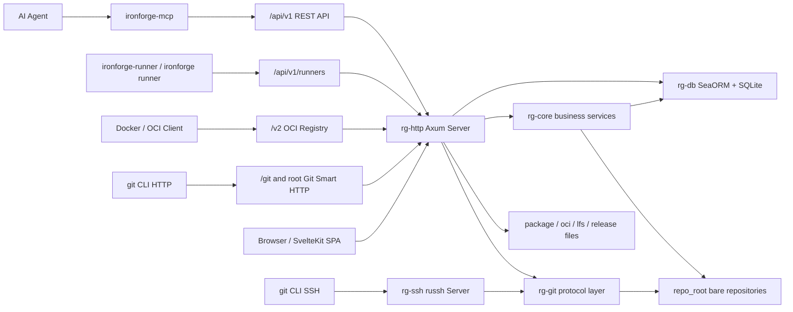

# IronForge 项目架构总览（2026-07）

**生成日期**: 2026-07-05  
**分析基线**: `main` 分支，`9088e2a`；并已回填 2026-07-05 修复波次后的工作区事实  
**事实来源**: 当前代码、配置、迁移、前端路由、测试、部署文件和架构修复回填  
**配套文档**:

- `ironforge-docs/archive/project-architecture-analysis-notes-2026-07.md`（过程记录，已归档）
- `ironforge-docs/architecture/frontend-backend-structure-2026-07.md`
- `ironforge-docs/architecture/architecture-followups-2026-07.md`

---

## 1. 系统定位

IronForge 是一个 Rust + SvelteKit 实现的轻量级 Git 托管平台。当前系统已经不只是仓库托管，还包含 Issue、PR、Wiki、CI/CD、Package Registry、OCI Registry、组织、通知、审计、SSO/MFA、Mirror、Import、Board、Time Tracking、MCP 等平台能力。

当前架构的核心特点：

- 后端是 Rust workspace，主服务二进制为 `ironforge`。
- 前端是 SvelteKit 静态 SPA，构建产物由后端静态托管。
- Git 服务同时支持 HTTP Smart Git 和 SSH。
- 数据库当前是 SQLite + SeaORM，迁移在服务启动时自动执行。
- CI 可以由主服务内置 runner 执行，也可以由外部 runner 轮询执行。
- Package Registry 分为 REST package API 和独立 OCI `/v2/` API。
- MCP server 是独立二进制，通过 IronForge REST API 访问数据。

---

## 2. 顶层架构



主要边界：

| 层 | 主要路径 | 职责 |
|----|----------|------|
| CLI/进程入口 | `crates/rg-cli/src/main.rs` | 主服务启动、迁移、配置、日志、一次性命令、内置 runner |
| HTTP 服务 | `crates/rg-http/src/lib.rs`、`crates/rg-http/src/api/` | REST、Git HTTP、OCI、WebSocket、OpenAPI、静态前端 |
| SSH 服务 | `crates/rg-ssh/src/lib.rs` | SSH 认证、Git command 分发 |
| 业务服务 | `crates/rg-core/src/` | 用户、仓库、Issue、PR、Wiki、CI、Package、审计、SSO/MFA 等 |
| 数据库 | `crates/rg-db/src/` | entities、ops、migrations |
| Git 协议 | `crates/rg-git/src/` | pkt-line、sideband、upload-pack、receive-pack、Protocol V2、Git CLI gateway |
| CI 引擎 | `crates/rg-ci/src/` | CI 配置读取、pipeline 创建、内置执行器 |
| Runner Agent | `crates/rg-runner/src/main.rs` | 外部 runner 注册、轮询、执行、回传日志 |
| MCP Server | `crates/rg-mcp/src/` | MCP tools/resources，调用 IronForge REST API |
| 前端 | `web/src/` | SvelteKit SPA 页面、API client、状态、i18n、组件 |

---

## 3. 运行入口

### 3.1 二进制入口

| 二进制 | crate | 入口 | 主要用途 |
|--------|-------|------|----------|
| `ironforge` | `rg-cli` | `crates/rg-cli/src/main.rs` | 主服务与管理 CLI |
| `ironforge-runner` | `rg-runner` | `crates/rg-runner/src/main.rs` | 独立 CI Runner Agent |
| `ironforge-mcp` | `rg-mcp` | `crates/rg-mcp/src/main.rs` | MCP stdio server |

### 3.2 主服务启动链路

`ironforge serve` 的实际启动链路：

```text
Cli::parse
  -> run_serve
  -> load optional TOML config
  -> resolve JWT/config/logging/timeouts
  -> init tracing
  -> create repo_root
  -> init rg_git::cli_gateway
  -> rg_db::connect_with_timeouts
  -> rg_db::run_migrations
  -> build AppState
  -> spawn rg_http::run(...)
  -> spawn rg_ssh::start_ssh_server(...)
  -> await HTTP task
```

重要运行特征：

- HTTP 与 SSH 在同一主服务进程中启动。
- SSH 启动失败不会阻止 HTTP 继续运行。
- HTTP route 同时承载 REST、Git HTTP、OCI、WebSocket、OpenAPI 和 SPA fallback。
- 数据库迁移在 `serve` 启动时自动执行。
- `host_key` 缺失时会自动生成 ed25519 key。

### 3.3 运行时依赖

| 依赖 | 用途 | 当前状态 |
|------|------|----------|
| SQLite | 主数据库 | `sea-orm` + `sqlx-sqlite` |
| Git CLI | pack、diff、archive 等剩余能力 | 通过 `GitCommandGateway` 管控 |
| gix | 部分 Git 读写与 diff 能力 | 已用于多处替代 Git CLI |
| Docker | CI Docker job、外部 runner 可选 | 内置 runner 和外部 runner 对指定 image 的 job 均 fail closed |
| SMTP | 邮件通知、密码重置 | 可选配置 |
| TLS cert/key | HTTPS | 可选 CLI/config |
| repo_root | bare repositories、package/lfs/oci 文件 | 必须可写 |

---

## 4. Rust Workspace 边界

当前 workspace 本地依赖方向：

```text
rg-cli  -> rg-ci, rg-core, rg-db, rg-git, rg-http, rg-ssh
rg-http -> rg-core, rg-db, rg-git
rg-ssh  -> rg-core, rg-db, rg-git
rg-core -> rg-db, rg-git
rg-ci   -> rg-core, rg-db
rg-db   -> no local crate deps
rg-git  -> no local crate deps
rg-runner -> no local crate deps
rg-mcp -> no local crate deps
```

职责判断：

- `rg-http` 是对外协议聚合层，不只是 REST API。
- `rg-core` 是业务和平台服务层，不是纯领域模型层。
- `rg-db` 提供 SeaORM entities、ops、migrations。
- `rg-git` 封装 Git wire protocol 和 Git CLI gateway。
- `rg-ci` 通过 `rg_core::ci::CiTrigger` 被注入 HTTP，保持 HTTP 与 CI 引擎解耦。
- `rg-runner` 和 `rg-mcp` 是独立客户端型二进制，通过 HTTP API 与主服务通信。

---

## 5. 数据模型

数据库实体大致分为以下领域：

| 领域 | 代表实体 |
|------|----------|
| 身份与认证 | `users`、`ssh_keys`、`access_tokens`、`password_reset_tokens`、`oauth_accounts`、`mfa_backup_codes`、`login_logs`、`sso_providers` |
| 仓库 | `repositories`、`repo_collaborators`、`repo_stars`、`repo_watches`、`protected_branches` |
| Issue / PR / Review | `issues`、`issue_comments`、`labels`、`issue_labels`、`milestones`、`pull_requests`、`pr_reviews`、`review_comments`、`pr_events`、`merge_queue_entries` |
| Wiki / Release / LFS | `wiki_pages`、`wiki_revisions`、`releases`、`release_assets`、`lfs_objects` |
| CI/CD | `pipelines`、`pipeline_stages`、`pipeline_jobs`（含 variables）、`runners`、`artifacts`、`commit_statuses` |
| 组织与通知 | `organizations`、`teams`、`team_members`、`organization_members`、`notifications` |
| Package / OCI | `package_registries`、`packages`、`package_versions`、`package_files`、`oci_repositories`、`oci_blobs`、`oci_manifests`、`oci_uploads` |
| 扩展能力 | `webhooks`、`webhook_deliveries`、`mirrors`、`boards`、`board_columns`、`board_cards`、`time_entries`、`import_tasks`、`audit_logs` |
| 搜索 | `repos_fts`、`issues_fts`、`wiki_pages_fts`、`code_fts` |

迁移要点：

- 迁移位于 `crates/rg-db/src/migrations/`。
- `serve` 和 `migrate` 都调用 `rg_db::run_migrations`。
- 已存在多次纠偏迁移，用于修复历史表名单复数不一致。
- SQLite FTS5 同时用于仓库、Issue、Wiki 和代码搜索。

---

## 6. HTTP 服务面

### 6.1 路由前缀

| 前缀 | 用途 |
|------|------|
| `/api/v1` | REST API |
| `/git/{owner}/{repo}/...` | Git Smart HTTP |
| `/{owner}/{repo}/info/refs` 等 root Git 路由 | 兼容 Git Smart HTTP |
| `/v2` | OCI Distribution Registry |
| `/api/v1/ws/notifications` | 通知 WebSocket |
| `/api/v1/ws/job/{job_id}` | CI job log WebSocket |
| `/health` | 健康检查 |
| `/metrics` | Prometheus metrics |
| `/api-docs` | Swagger UI / OpenAPI |
| SPA fallback | `web/build/index.html` |

### 6.2 REST API 分组

`crates/rg-http/src/api/` 当前包含 30+ 个 API 模块，覆盖：

- users/auth/mfa/sso/admin/audit；
- repos/repo_content/archive/search/ai；
- issues/labels/pulls/reviews/wiki/releases；
- orgs/collaborators/branch_protection/webhooks；
- ci/runners/artifacts/notifications；
- packages/imports/mirrors/boards/time_tracking/lfs。

REST handler 的边界并不完全统一：多数业务通过 `rg-core` service，部分 handler 直接调用 `rg-db::ops`。最终维护上应继续向“handler -> core service -> db ops”收敛。

### 6.3 中间件

生产 router 包含：

- metrics middleware；
- security headers + CSP nonce；
- request id；
- `TraceLayer`；
- CORS；
- `ConnectInfo`；
- rate limit；
- maintenance mode；
- PAT-to-Bearer middleware；
- docs auth middleware。

---

## 7. Git 与 SSH 协议层

Git 协议由 `rg-git` 承担：

| 模块 | 职责 |
|------|------|
| `pkt_line.rs` | pkt-line 编解码 |
| `sideband.rs` | sideband-64k |
| `protocol/upload_pack.rs` | upload-pack |
| `protocol/receive_pack.rs` | receive-pack |
| `protocol/v2.rs` | Protocol V2 ls-refs/fetch/object-info |
| `cli_gateway.rs` | Git CLI 调用统一入口 |

HTTP Git 与 SSH Git 共同复用 `rg-git` 协议层，但入口不同：

```text
HTTP Git
  -> rg-http handle_info_refs / upload-pack / receive-pack
  -> JWT/PAT auth + repo can_read/can_write
  -> rg-git protocol

SSH Git
  -> rg-ssh exec_request
  -> ssh key/password auth
  -> git-upload-pack / git-receive-pack dispatch
  -> rg-git protocol
```

当前需要注意的边界：

- HTTP Git 已接入仓库读写权限。
- SSH Git 已在 exec path 接入 repo-level `can_read/can_write` 检查。
- receive-pack 已在 HTTP/SSH Git pack/ref 更新前接入 protected branch rejected refs，禁止直推会返回 `ng`。
- V1 upload-pack 的 pack 生成仍偏简单，大仓库性能需要后续优化。

---

## 8. 安全与认证

认证方式矩阵：

| 类型 | 用途 |
|------|------|
| JWT | Web 登录、REST、WebSocket |
| HttpOnly Cookie | 浏览器会话，cookie 名 `ironforge_token` |
| PAT | API client、Git HTTP、docs access |
| SSH Key / Password | SSH Git |
| TOTP MFA | 登录 step-up |
| OAuth2 SSO | 外部身份 provider |
| LDAP | 主登录、首次建号、Provider 身份绑定与管理员连接测试 |
| Runner Token | 外部 runner API |
| CI Job Token | CI job 最小权限 token，已接入 repo/package 读路径 |
| Deploy Key | 仓库级 SSH 身份；只允许绑定仓库，读写由 `read_only` 控制 |
| OCI Token | `/v2` registry bearer token |

安全中间件包括 CSP、安全 headers、CORS、Request-ID、Rate Limit、维护模式和审计日志。

当前 P0/P1 安全和权限缺口已完成首轮修复，需要继续保持的实现边界：

- 浏览器用户 API 优先使用 cookie-aware 的 `AuthUser` / `extract_user_id`，避免新增 Bearer-only handler。
- PAT、Git HTTP、Runner token、CI job token 和 OCI token 保持各自语义，不混用为同一个认证入口。
- 启用的 LDAP Provider 进入 `/users/login` 主链路：本地账号只校验本地密码且绝不回退到 LDAP；目录用户成功 bind 后才首次建号，密码不落库，后续按 `ldap_provider_id + ldap_uid` 绑定来源。历史未绑定 Provider 的 LDAP 用户仅在实例恰有一个启用 LDAP 源时允许完成首次绑定。LDAP 查询值按 RFC 4515 转义、搜索结果必须唯一、空密码拒绝、连接与认证限时 10 秒，未显式声明 `ldap://` 时默认使用证书校验的 LDAPS 636。
- 本地密码、LDAP 和 SSO 第一因素通过后，如用户启用 MFA，服务端只设置使用独立签名域的五分钟 HttpOnly challenge cookie，不签发用户 JWT；`/users/mfa/verify` 必须校验 challenge 的用户、期限和认证来源，成功后清除 challenge 并签发会话。已存在的用户名直调 MFA 接口不再可用。密码/MFA 成功与失败写入 `login_logs`，已知账户连续五次失败锁定 15 分钟；失败次数通过单条条件更新原子累加，避免并发请求丢失计数。仅完整登录成功才重置失败计数并更新 `last_login_at`，重新完成第一因素不能清空 MFA 失败次数。
- 已被 LDAP 用户或 OAuth account 引用的 SSO Provider 禁止删除，管理员需先禁用或迁移关联身份，避免目录用户被静默遗留为无法登录的悬挂账号。
- 管理员可对已保存 LDAP Provider 调用连接测试；服务端解密绑定密码后按同一 TLS/端口/10 秒超时策略执行 service bind，详细连接错误仅写服务日志，HTTP/UI 只返回脱敏结果。
- 历史迁移中 `OAuthAccounts` 的自动标识符曾生成 `o_auth_accounts`，与实体使用的 `oauth_accounts` 不一致；兼容迁移检测旧名后原子改名，已有正确表名的实例保持不变。
- `login_logs` 通过管理员专用分页 API/UI 查询，支持用户名、认证 Provider、成功/失败和 ISO 时间范围筛选；展示 IP、User-Agent 与规范化失败原因，用于排查密码、LDAP、SSO 和 MFA 锁定事件，普通用户无法读取。
- 管理员用户列表返回认证来源、失败次数、锁定截止时间与最近完整登录时间；管理员可调用 unlock API 原子清除失败计数和锁定，操作写入 `admin.unlock_user` 审计事件并保存解锁前状态。
- 仓库关联资源继续通过 `can_read_repo` / `can_write_repo` 做 repo-scoped 授权。
- LDAP TLS 默认校验证书，只有显式 insecure 配置才跳过校验。
- Rate limit 默认只信任 socket IP，只有配置可信代理后才读取转发头。

详细清单位于 `architecture-followups-2026-07.md`。

---

## 9. CI/CD、Package、MCP 扩展能力

### 9.1 CI/CD

CI 支持：

- `.ironforge-ci.yml` 原生格式；
- `.gitea/workflows/*.yml` Gitea/GitHub Actions 兼容转换；
- pipeline/stage/job DB 记录；
- 内置 runner；
- 外部 runner long-poll；
- job log queue；
- runner labels/tags；
- CI job token 生成。
- job variables 持久化并注入内置/外部 Runner；保留变量不能被工作流覆盖；
- Merge Queue speculative merge-group pipeline；
- Gitea Actions 为有限 adapter：`checkout` 隐式支持，其他 `uses:` fail closed，完整能力使用原生 `.ironforge-ci.yml`。
- 仓库级 CI Secrets 使用 AES-256-GCM 加密，仅管理员可管理；值注入内置、Docker 和外部 Runner，日志在执行端/服务端持久化前脱敏。
- 原生 `matrix` 与 Gitea Actions `strategy.matrix` 在建流水线时展开为独立 job，采用 256 变体硬上限。
- Tag 保护以通配 pattern 存储，由 HTTP/SSH 共用的 receive-pack 拒绝模式匹配执行。
- 受保护分支可要求密码学签名：receive-pack 完成 pack 索引后、写 ref 前，对新提交逐一执行 `verify-commit`；失败只拒绝对应 ref。当前服务端没有签名密钥，因此平台生成的 PR merge/auto-merge/merge queue commit 在该策略下明确拒绝，不生成不符合规则的提交。
- Actions adapter 对 step 级未知 action 和 job 级 Reusable Workflow 均 fail closed，不允许空 job 假成功。
- 内置 Runner 为 pipeline 创建精确 commit 的 detached worktree；独立 Runner 从分配校验后的 workspace API 下载同一 commit 的 tar 快照，本地与 Docker executor 都在隔离目录执行。
- CI Cache 按 `repo_id + SHA-256(resolved key)` 隔离，路径限定在 workspace 内；原生 `cache` 和 `actions/cache@v4` 统一映射，内置/外部 Runner 均在成功 job 后原子保存。
- Reusable Workflow 仅解析同一 commit 的 `.gitea/workflows` 本地文件：展开后重写 root/leaf `needs`，inputs 映射为 `INPUT_*`，支持 `secrets: inherit`；深度超过 4、循环、远程目标和命名 Secret 重映射 fail closed。
- `allow_failure`、per-job timeout 与 `when_condition` 是持久化执行策略：内置 Runner 和外部 Runner 都消费相同字段，允许失败的 job 保留失败状态但不使 stage 失败；timeout 取 1-86400 秒并终止执行；`when: manual` 将 job/stage/pipeline 暂停为 `manual`，仓库写权限用户通过 play API 原子释放，Runner 从精确提交工作区恢复且跳过已完成 job。外部 Runner 的 pending job 选择（包括无标签 Runner）统一执行前置 stage 门控；前置 stage 失败后，尚未启动的下游 stage/job 自动转为 `skipped`，流水线以规范化 `failed` 状态收敛，同时读取旧 `failure` 状态保持兼容。
- `if_condition` 保存原生/Actions Job 静态条件；安全解释器支持 `github.ref/ref_name/event_name/sha`、`env.*`、`matrix.*`、`!`/`&&`/`||`、括号、`==`/`!=`、`startsWith`/`endsWith`/`contains` 和 `success()`。Job 条件按 Matrix 变体求值，false 变体持久化为 `skipped`；Step 条件在 Actions 转换阶段求值。未知上下文、函数、字符及需要运行时依赖状态的 `always/failure/cancelled` fail closed，不调用 shell `eval`。Actions 脚本以 `set -e` 保持 Step 失败传播。
- 原生 `environment` 与 Actions job `environment` 会持久化至 pipeline job。命中受保护环境时状态机暂停为 `waiting_approval`；管理员或显式审批人按配置票数审批，同一用户对同一 job 只计一票。一个 stage 含多个受保护 job 时，全部 gate 释放后才恢复 Runner，防止并发恢复；环境一旦被 pipeline 历史引用便禁止删除，以保留审批记录。
- CI workload identity 提供 OIDC discovery、Ed25519 JWKS 与 token exchange。运行中的 job 使用 `Authorization: Bearer $CI_JOB_TOKEN` 请求 `$CI_OIDC_TOKEN_URL?audience=<provider>`，获得 5 分钟、不可复用到其他 audience 的 JWT；服务端同时校验签名中的 repo/pipeline/job 与数据库关系和 job 运行态。配置 `external_url` 时内置与外部 Runner 都注入稳定的 `CI_OIDC_TOKEN_URL`。
- CI 存储保留由仓库级 `ci_retention_policies` 控制（Artifact 默认 30 天、Cache 默认最后访问后 7 天，范围 1-3650 天）。Artifact 上传即固化 `expires_at`；本地/Docker/外部 Runner 的 Cache 都写入 `ci_cache_entries` 并在命中时滑动续期。后台每小时及管理员手动入口按“受管根目录校验 → 文件删除 → DB 删除”回收，路径异常只记录失败而不会越界删除。

### 9.2 Package Registry

Package Registry 由通用 DB 模型、文件存储和 adapter 组成。

专用协议端点覆盖：

- Cargo sparse index；
- npm metadata；
- PyPI simple index；
- Maven metadata；
- NuGet service/registration/search；
- RubyGems dependencies/gem info；
- Helm index；
- Composer packages.json；
- Docker/OCI `/v2`。

前端和后端常量列出 17 种 package type，但真正有专用协议/adapter 的类型少于 17 个，其余会落到 generic 存储处理。

### 9.3 MCP

`ironforge-mcp` 默认 stdio，读取：

- `IRONFORGE_URL`
- `IRONFORGE_PAT`

暴露 tools：

- `list_repos`
- `read_file`
- `read_dir`
- `get_issue`
- `get_pr`

暴露 resources：

- `repo://{owner}/{name}`
- `file://{owner}/{name}/{path}`
- `issue://{owner}/{name}/{number}`

`--sse` 目前未实现，不能作为可用 transport 描述。

---

## 10. 构建、部署与运维

### 10.1 构建产物

```text
web npm run build
  -> web/build

cargo build --release --bin ironforge
  -> target/release/ironforge
```

Docker 构建链路：

```text
node frontend build
  -> rust release build --bin ironforge --bin ironforge-runner --bin ironforge-mcp
  -> debian runtime
  -> copy /app/web/build
  -> copy /usr/local/bin/ironforge
  -> copy /usr/local/bin/ironforge-runner
  -> copy /usr/local/bin/ironforge-mcp
```

### 10.2 运行数据

默认 Docker runtime 数据：

```text
/data/repos
/data/ironforge.db
/data/logs/ironforge.log
```

### 10.3 健康检查与观测

`/health` 检查：

- database；
- filesystem；
- metrics；
- git gateway；
- smtp。

`/metrics` 输出 Prometheus text format。`deploy/` 中提供 Prometheus、Alertmanager、Grafana 和 node-exporter 示例配置。

### 10.4 测试体系

当前验证体系包括：

- Rust unit tests；
- `rg-http` integration tests；
- `cargo-llvm-cov`；
- `web npm run check`；
- `web npm run build`；
- `scripts/full-interface-regression.mjs`；
- OpenAPI smoke；
- API client contract check；
- frontend/backend smoke；
- browser console/admin smoke；
- 多个领域 contract check。

---

## 11. 当前架构口径修正

相对旧 `ARCHITECTURE.md` 和历史 Phase 文档，当前应采用以下新口径：

- 系统当前不是“纯核心 Git 平台”，而是带 CI、Package、SSO/MFA、审计、导入、看板、工时、MCP 的平台型服务。
- 数据库仍是 SQLite-only，PostgreSQL 是后续方向，不是当前能力。
- 前端是静态 SPA，不是 SSR 应用。
- `client.svelte.ts` 当前是 38 行纯 re-export 兼容入口；API 真实实现已按领域拆到独立模块。
- Docker runtime 镜像包含 `ironforge`、`ironforge-runner`、`ironforge-mcp` 三个二进制。
- `--sse` MCP transport 未实现。
- 本轮 P0/P1 安全、权限和部署缺口已完成首轮修复；长期生产化方向仍包括 PostgreSQL、MCP SSE、Package 专用协议补全和 gix 后续迁移。

---

## 12. 建议阅读顺序

1. 本文：理解顶层架构与运行模型。
2. `frontend-backend-structure-2026-07.md`：定位前端页面、API client、后端模块和数据库结构。
3. `architecture-followups-2026-07.md`：查看需要修复的架构差异、权限缺口和运维缺口。
4. `project-architecture-analysis-notes-2026-07.md`：追溯每轮源码分析细节。
